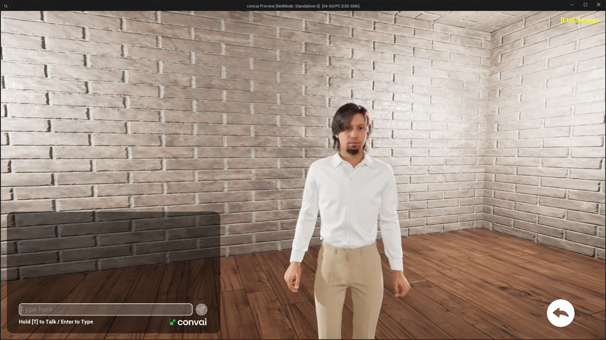
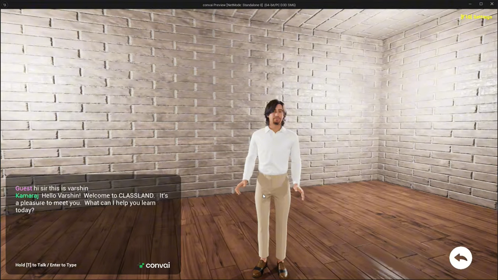
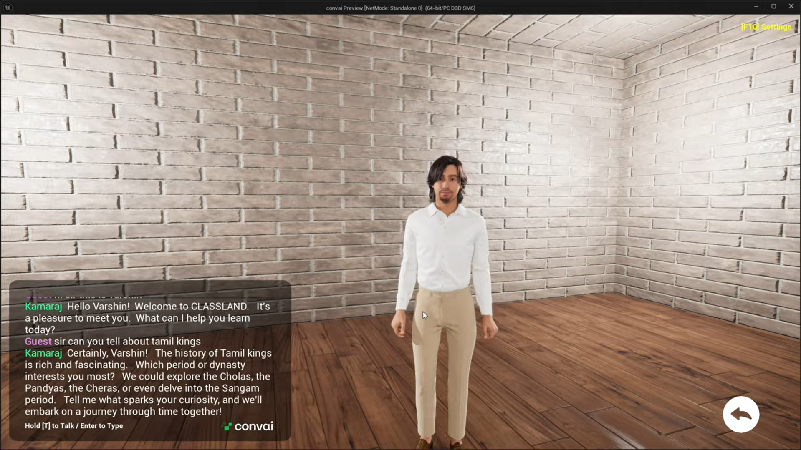
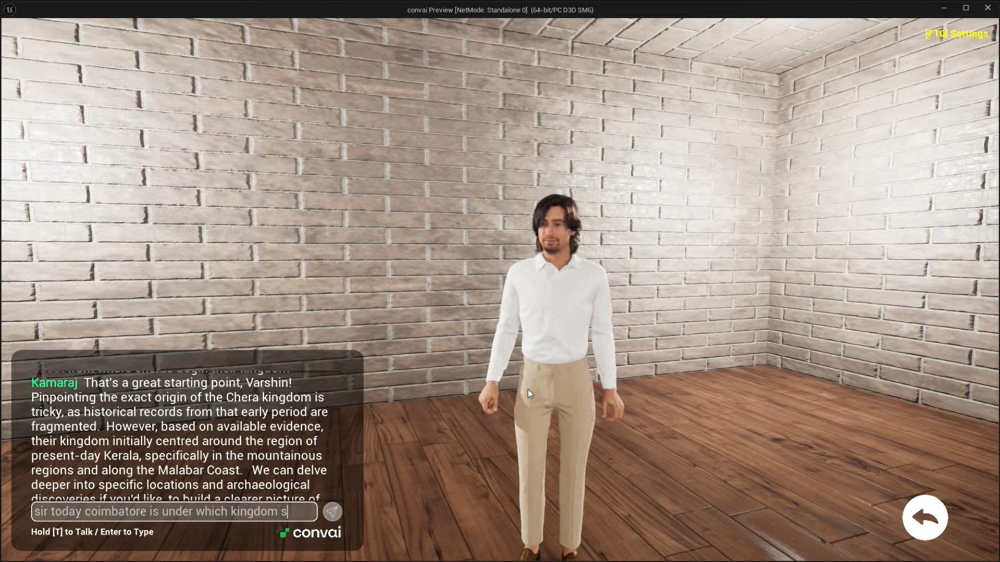

# 🤖 ClassLand

  

## 📖 Overview

ClassLand is an AI-powered virtual classroom built in Unreal Engine 5. The project integrates MetaHuman characters and ConvAI to create interactive educational experiences where users can communicate naturally with AI-driven virtual instructors.

---

## ✨ Features

- 🤖 AI-powered NPC conversations
- 🧑 MetaHuman virtual instructor
- 🎙️ Voice interaction with ConvAI
- 🏫 Interactive classroom environment
- 🎮 First-person exploration
- 🔵 Blueprint-based gameplay

---

## 🛠 Tech Stack

- Unreal Engine 5
- Blueprints
- MetaHuman
- ConvAI
- Quixel Megascans
- Lumen
- Nanite

---

## 🎥 Demo Video

https://youtu.be/RG54rRYhiKQ

---

## 📸 Gallery

---

## 👨‍💻 My Contribution

- Developed the virtual classroom in Unreal Engine 5
- Integrated MetaHuman characters
- Connected ConvAI for AI-powered conversations
- Designed the classroom environment
- Implemented Blueprint interaction systems
- Configured lighting and cinematic presentation

---

## 🚀 Future Improvements

- Multi-user classroom support
- AI student assistants
- Quiz and assessment system
- Multiplayer collaboration

---

⭐ If you enjoyed this project, don't forget to star the repository!
